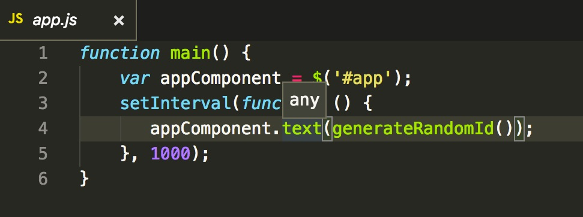
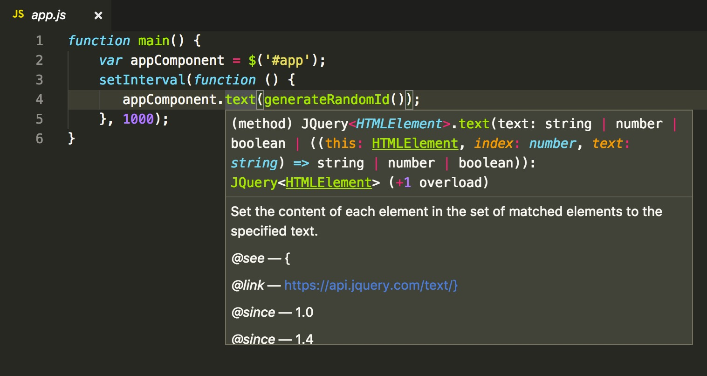

## Kom i gang med TypeScript
TypeScript benyttes mere og mere. TypeScripts popularitet blev hjulpet af Angular men idag bruger stadig
flere og flere TypeScript som sprog til generel web udvikling. 
Vi vil i det følgende vise at man nemt kan introducere TypeScript i eksisterende JavaScript applikationer og høste en masse fordel ved dette.

### En simpel JavaScript app
Som demonstration på hvordan man gradvis opgraderer sine web applikation til TypeScript benytter vi en simple web application der udskriver et random token en gang i sekundet. 
```
example/
    index.html
    app.js
    randomGenerator.js
```

```index.html```  kalder en ```main``` funktion efter at hele dom'en er
loaded:

```
$(function() {
    main();
});

```

```main``` funktionen er defineret i ```app.js :```

``` javascript
function main() {
    var appComponent = document.getElementById('app');
    setInterval(function() {
        appComponent.innerHTML = generateRandomId();
    }, 1000);
}
```
``` main ``` funktionen finder et element i dom'en via id
og renderer et nyt random token ind i elementet hvert sekund.

Til at beregne et random token benytter vi funktionen ``` generateRandomId ``` fra filen ```randomGenerator.js```

``` javascript
function generateRandomId() {
    return '#' + Math.random().toString(36).substr(2, 7)
}
```
Al koden til denne artikel finder du [her](https://github.com/krogh/StartMedTypeScript)
Når du har hentet koden ned kan du åbne ```index.html``` i en browser for at se applikation live.

###  Benyt TypeScript
Vi vil nu sætte app'en op til at bruge TypeScript.
I example-ts har vi kopieret vores app filer fra ```example/```
ind i følgende struktur
```
    example-ts/
        dist/
            index.html
        src/
            app.js
            randomGenerator.js
```
Inden vi kan benytte TypeScript skal vi have det installeret. Det gør vi med følgende kommando. (Her antager vi at du har nodejs installeret)
```
    npm install -g typescript
```

Nu skal vi have vores projekt initialiseret til at benytte TypeScript. Det er kun nødvendigt at gøre dette én gang. Vi initialisere vores projekt via kommandoen mens vi står i ```./example``` biblioteket:

```
    tsc --init
```

Denne kommando tilføjer typescript projekt filen
 ``` tsconfig.json``` til vores TypeScript projekt. Filen bliver benyttet af TypeScript kompileren, og fortæller TypeScript hvorledes vi ønsker vores filer kompileret.

Vi retter indholdet af ``` tsconfig.json``` til :
``` json
{
    "compilerOptions": {
        "outDir": "dist"
    },
    "files": [
        "src/app.js",
        "src/randomGenerator.js"
    ]    
}
```
``` "files"``` angiver hvilke filer der skal kompileres og ``` outDir```
angiver i hvilken folder de kompilerede filer skal placeres.

Vi er nu klar til den første kompilering.
Kører vi kommandoen ``` tsc`` kommer følgende fejl:
```
error TS6054: File 'example-ts/src/app.js' has unsupported extension. The only supported 
extensions are '.ts', '.tsx', '.d.ts'.
```
For at komme over denne hurdle konfigurere vi tsc til at acceptere Javascript filer. 

I ``` tsconfig.json```
``` json
"compilerOptions": {
        "allowJs": true,
        "outDir": "dist"
```
```"allowJs": true ``` tillader Typescript compileren at kompile JavaScript filer.
Kompilerer vi igen kan vi se at kompileren kører uden fejl og at der er kommet en ```app.js``` og en ```randomGenerator.js``` fil i ```dist``` folderen.
De er næsten identisk med dem i ```src``` folderen på nær lidt formatering. 
Åbner vi vi vores index.html fra ```dist``` folderen i en browser ser vi at app stadig virker som før.

### Refactor til TypeScript
Vi er nu klar til at refactore dele af koden til TypeScript.
Med ```"allowJs": true ``` kan vi nu selv vælge hvilke dele af kodebasen vi ønsker at konvertere til TypeScript.
Vi vælger i dette tilfælde at refaktorere ```randomGenerator.js``` filen til TypeScript.
Først omdøber vi filen til ```randomGenerator.ts``` og retter ```tsconfig.json``` 

``` json
    "files": [
        "src/app.js",
        "src/randomGenerator.ts"
    ]    
``` 
Nu kan vi benytte alle TypeScripts features i ```randomGenerator.ts```.
Vi starter med at introducere typer. Typer er en af de helt centrale feature i TypeScript.

``` typescript
var token: string = '#';
const base: number = 36;

function generateRandomId() {
    return token + Math.random().toString(base).substr(2, 7)
}
```
Vi har her valgt at tildele typer til ```token``` og ```base```.
```base``` er ydermere erklæret som et konstant.

Bemærk hvordan den kompilerede ```dist/randomGenerator.js``` ser ud.
```const``` compileres til ```var```. Det er fordi default target for compilering er ```es3```
Konfiguerer vi ```"target"="es2015``` hvor der findes konstanter giver kompileringen i stedet:
```typescript
const token = "#";
```  
```es2015``` har const og TypeScript respekterer dette.
Denne evne til at kompilerer til flere forskellige version af JavaScript kaldes for transpiling.

Et endnu bedre eksempel på dette er hvis vi introducerer klasser i ```randomGenerator.ts```
```typescript
var token:String = "#";
const base: number = 36;

class TokenGenerator {
    base: number;
    token: String;
    constructor(base: number, token: String) {
        this.base = base;
        this.token = token;
    }
    generateToken() :String {
        return token + Math.random().toString(base).substr(2, 7);
    }
}

var generator: TokenGenerator = new TokenGenerator(base,token);
function generateRandomId() {
    return generator.generateToken();
```
Med ```"target": "es2015``` kompileres det til klasse konstruktion som es2105 har:
``` javascript
class TokenGenerator {
    constructor(base, token) {
        this.base = base;
        this.token = token;
    }
    generateToken() {
        return token + Math.random().toString(base).substr(2, 7);
    }
}
```

med ```"target": "es5"``` falder vi tilbage til et traditionelt JavaScript IIFE (Immedeatly-Invoked Function Experession) pattern for at skabe et object med klasse lignende egenskaber.

```
var TokenGenerator = (function () {
    function TokenGenerator(base, token) {
        this.base = base;
        this.token = token;
    }
    TokenGenerator.prototype.generateToken = function () {
        return token + Math.random().toString(base).substr(2, 7);
    };
    return TokenGenerator;
}());
```
Typescript giver os således også egenskaben at have mere advancerede javascript konstruktion end vores target egentlig tillader. Transpilingen sørger for at vi havner i en eksekverbar udgave i de browsere vi understøtter.

#### Strict null check
Selvom vi har valgt at kun at refaktorere ```randomGenerator.js```, kan vi lade TypeScript kompileren checke JavaScript koden i ```app.js```.
Ved at konfigurere ```tsconfig.json``` med 
```json
    "checkJs": true,
```
vil kompileren også rapportere fejl  i JavaScript filer. Et eksempel er med kompiler setting

```json
    "strictNullChecks": true,
```
vil give en kompilerings fejl 
```
src/app.js(5,9): error TS2531: Object is possibly 'null'.
```
Ser vi i koden kan ``` document.getElementById('app')``` ganske rigtigt returnere ```null``` hvis der ikke findes et element med id ```app``` i dom'en.
Det tager vores kode ikke højde for. I det tilfælde vil ```appComponent.innerHTML = generateRandomId()``` i linie 5 give exception.
Vi kan dog ændre koden så vi undgår problemet.
```
 if (appComponent) {
    appComponent.innerHTML = generateRandomId();
 }
```
Med denne udgave af koden undgår vi kompiler fejl og røde markeringer i editoren.   

#### Sourcemap debug med TS code
En kritik af at have et ikke JavaScript sprog og et kompilerings trin før man
får eksekverbar kode er at den kode man skriver ikke er der der køre i browseren.
Det kan feks gøre debugging besværlig. Dette kan man dog minimiere vha. source maps.
Sætter vi  
``` json
"sourceMap": true
```
 i ```tsconfig.json``` genererere TypeScript kompileren ekstra filer
til debug. Feks får vi en ```randomGenerator.js.map```
Denne fil giver et map mellem den oprindelige TypeScript fil ```randomGenerator.ts``` og den transpileret JavaScript fil. Med dette map 
kan vi sætte breakpoints i TypeScript filen samt lave inspektion af værdier.

#### Refactoring og IntelliSense
Med TypeScript har editoren nu mulighed for at give udvikleren meget mere støtte.
Inline hjælp til en funktions eller klasses API. Navigering til en definitionen af en klasse eller fil. Og markering af fejl der vil lede til kompilerings fejl.  
Udover over editor understøttelsen til IntelliSense giver TypeScript også muligheden for 
at refaktorer koden meget mere effektivt en klassisk JavaScript. Renavngivning af klasse og variabel navne virker på tværs af filer sikrer en højere kode kvalitet som ellers kun kunne fanges i test.

#### Typings

Som i måske har lagt mærke til, så benytter vi jQuery i vores index.html.
Vi kunne kode vores ```app.js``` om til at benytte jQuery istedet for.   
<figure>
    
    <figcaption>IntelliSense viser kun 'any' i VS Code</figcaption>
</figure>

Her er der dog ikke IntelliSense da jQuery ikke er baseret på TypeScript. ```any``` er typescript's default besked når den ikke kan udelede noget om funktionen.
Så hvordan får vi IntelliSense fra eksisterende JavaScript baserede biblioteker?

Det gør vi via TypeScript definition files. Det er filer der beskriver parameter type, retur typer etc. på JavaScript bibliotker, som var de skrevet i TypeScript.

Via @types projektet kan vi installere definitionsfiler på en meget stor del af populære JavaScript librairies. (Op mod 2000)

Her installere vi jQuerys typings
```
npm install --save @types/jquery
```

Introducerer vi nu noget jquery kode i vores ```app.js```´
```javascript
function main() {
    var appComponent = $('#app');
    setInterval(function () {
       appComponent.text(generateRandomId());
    }, 1000);
}
```
kan vi i editoren se intellisense forslag fra jquery typings.

<figure>
    
    <figcaption>IntelliSense virker nu i VS Code</figcaption>
</figure>

#### Konklusion

Som man kan se ved ovenstående eksempler, så er det relativt nemt at komme i gang med TypeScript, også i eksisterende JavaScript projekter.

TypeScript gør udviklingen mere effektivt, vha. velfungerende IntelliSence, refactoring, samt ved at fange fejl på kompiletidspunktet, i stedet for i test.

Vi har kun skrabet overfladen med hensyn til TypeScript funktionalitet og muligheder. Kom og hør meget mere på vores en-dags
TypeScript kursus hvor vi vil gå i dybden med TypeScript. 

Kontakt os <michael@kroghdata.com> og <flemming@bregnvig.dk> for mere information.
